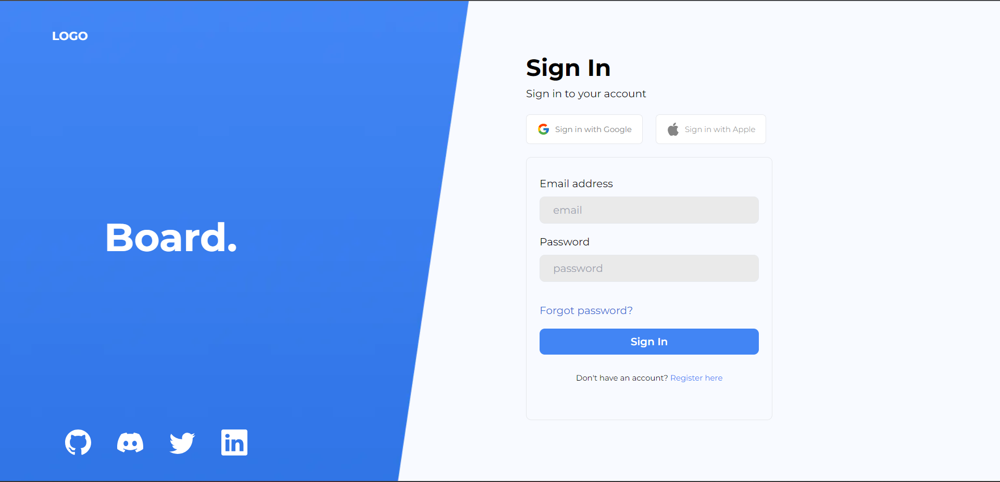
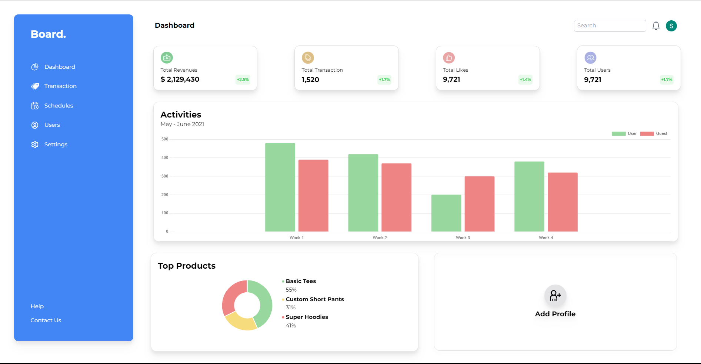
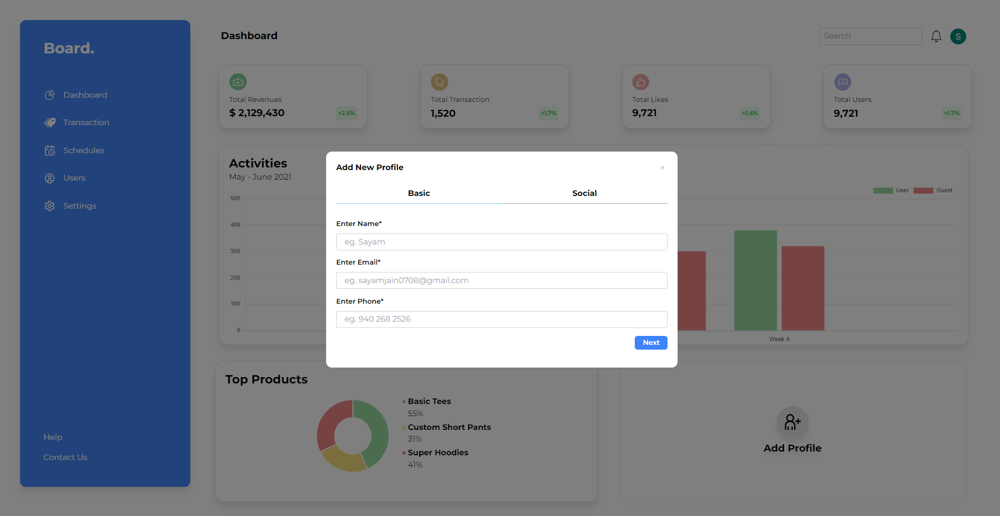
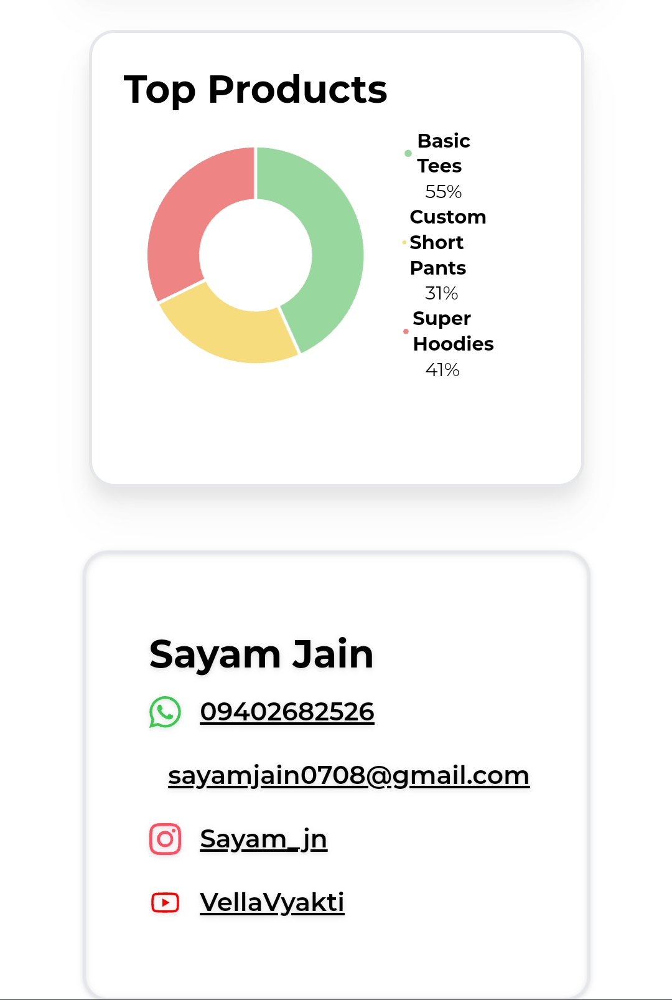

# Next.js Dashboard Application with User Authentication

This is a sample Next.js application that demonstrates how to create a dashboard with user authentication using [NextAuth.js](https://next-auth.js.org/).

## Table of Contents
- [Live Link](#live-link)
- [Video Preview](#video-preview)
- [Screenshots of App](#screenshots-of-app)
- [Responsive](#responsive)
- [Getting Started](#getting-started)
- [Learn More](#learn-more)
- [Deploy on Vercel](#deploy-on-vercel)
- [Introduction](#introduction)
- [Folder Structure](#folder-structure)
- [Components](#components)
- [Pages](#pages)
- [Authentication](#authentication)
- [Hooks](#hooks)
- [Usage](#usage)

---

## Live Link

Explore the live application: [Next.js Dashboard](https://assign-sand.vercel.app/)

## Video Preview

Watch the video previews of the application:
- [Video 1](./public/20230918-0625-16.7410513.mp4)
- [Video 2](./public/20230918-0632-39.9706080.mp4)

## Screenshots of App





## Responsive






## Introduction

This Next.js application provides a starting point for building a dashboard with user authentication. Customize it further according to your specific requirements.

## Folder Structure

The project's folder structure is organized as follows:

/components: Contains reusable React components used throughout the application.
/pages: Defines the Next.js pages and routes.
/hooks: Contains custom React hooks used for state management.
/public: Stores static assets, such as images.

## Components

### Dashboard

The Dashboard component represents the authenticated user's dashboard.

### SignIn

The SignIn component provides the user sign-in interface.

### NavBar

The NavBar component displays the navigation bar with user information and sign-out functionality.

### UserAdd

The UserAdd component allows users to add their information.

## Pages

### index.js

The index.js page is the entry point of the application. It handles user authentication and renders the dashboard or sign-in page based on the user's session status.

## Authentication

Authentication is implemented using NextAuth.js. The `getServerSideProps` function is used to fetch the user's session on the server side.

## Hooks

### useUser

The useUser hook manages user-related state and actions, allowing components to access and update user data.

## Getting Started

To run this application locally, follow these steps:

1. **Clone this repository to your local machine:**

   ```bash
   git clone <repository-url>
Navigate to the project directory:

bash
Copy code
cd nextjs-dashboard-auth
Install the required dependencies:

bash
Copy code
npm install
# or
yarn install
Create a .env.local file and configure your NextAuth.js credentials (e.g., Google, GitHub, etc.). Refer to the NextAuth.js documentation for configuration details.

Start the development server:

bash
Copy code
npm run dev
# or
yarn dev
Open your browser and access the application at http://localhost:3000.

This project uses next/font to automatically optimize and load Inter, a custom Google Font.

Learn More
To learn more about Next.js, take a look at the following resources:

Next.js Documentation - learn about Next.js features and API.
Learn Next.js - an interactive Next.js tutorial.
You can check out the Next.js GitHub repository - your feedback and contributions are welcome!

Deploy on Vercel
The easiest way to deploy your Next.js app is to use the Vercel Platform from the creators of Next.js.

Check out our Next.js deployment documentation for more details.

This README now includes a live link to the application, video previews, screenshots, and additional information about getting started and deploying the project on Vercel.


This README now combines both sets of content into one comprehensive document.
